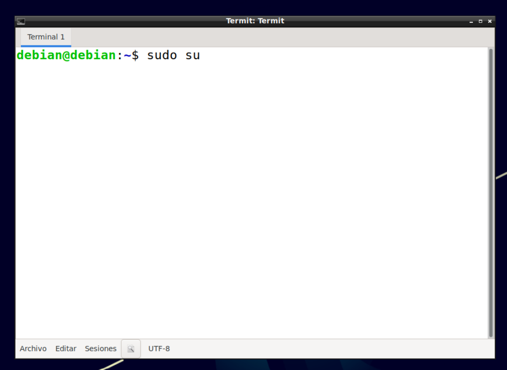

# Instalación Debian 11

- [Instalación Debian 11](#instalación-debian-11)
  - [Ususario rol de sudo](#ususario-rol-de-sudo)
  - [Proxy en variables de sistema](#proxy-en-variables-de-sistema)
  - [Actualización del sistema](#actualización-del-sistema)
  - [Instalar Guest Additons](#instalar-guest-additons)
  - [Instalar Herramientas](#instalar-herramientas)
    - [Git](#git)
    - [Autenticación usuario GIT](#autenticación-usuario-git)
    - [Visual Studio Code](#visual-studio-code)
    - [Plugings Visual Studio Code](#plugings-visual-studio-code)

## Ususario rol de sudo

## Proxy en variables de sistema

## Actualización del sistema

## Instalar Guest Additons

## Instalar Herramientas

### Git

### Autenticación usuario GIT

### Visual Studio Code

### Plugings Visual Studio Code
